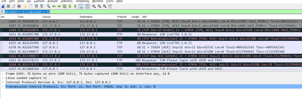
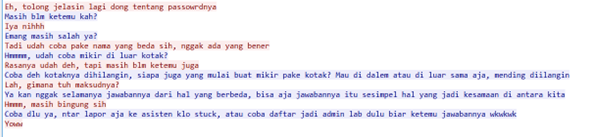

# Jarkom-Modul-1-ITB07-2022

<hr>
<h3>Kelompok ITB07 </h3>
5027201004 Alda Risma Harjian <br>
5027201042 Ilham Muhammad Sakti	<br>
5027201067 Naufal Ramadhan <br>
<hr>

1.  Sebutkan web server yang digunakan pada "monta.if.its.ac.id"! <br>
    **Jawaban** <br>
    Filter: http.host==monta.if.its.ac.id <br>
    Server: nginx/1.10.3 <br>

    

2.  Ishaq sedang bingung mencari topik ta untuk semester ini , lalu ia datang ke website monta dan menemukan detail topik pada website “monta.if.its.ac.id” , judul TA apa yang dibuka oleh ishaq ?<br>
    **Jawaban:**<br>
    http.host==monta.if.its.ac.id && frame matches "topik" <br>
    file > Export Objects > HTTP > save “lihatTopik” dalam bentuk .html <br>
    
    

3.  Filter sehingga wireshark hanya menampilkan paket yang menuju port 80! <br>
    **Jawaban:**<br>
    dst port 80 atau tcp.dstport == 80 <br>
    tcp.dstport == 80 || udp.dstport == 80 <br>
    

4.  Filter sehingga wireshark hanya mengambil paket yang berasal dari port 21! <br>
    **Jawaban:** <br>
    tcp srcport == 21 || udp srcport == 21 <br>
    tcp.srcport == 21 || udp.srcport == 21 <br>
    

5.  Filter sehingga wireshark hanya mengambil paket yang berasal dari port 443! <br>
    **Jawaban:**<br>
    tcp src port 443 || udp src port 443 <br>
    tcp.srcport == 443 || udp.srcport == 443 <br>
    

6.  Filter sehingga wireshark hanya menampilkan paket yang menuju ke lipi.go.id ! <br>
    **Jawaban:**<br>
    http.host==lipi.go.id <br>
    dst host lipi.go.id <br>
    

7.  Filter sehingga wireshark hanya mengambil paket yang berasal dari ip kalian! <br>
    a. Cek ip yang digunakan pada komputer yang digunakan menggunakan ipconfig. <br>
    b. IP == 192.168.0.133 <br>
    c. Lakukan start captuting packets, kemudian lakukan searching di internet. <br>
    d. Untuk melihat ip paket yang berasal dari ip kita, lakukan display filter dengan <br>
    ip.src == 192.168.0.133 <br>
    e. Berikut merupakan hasil ketika Wireshark mengambil paket yang berasal dari IP kami. capture <br>
    

Untuk soal 8-10, silahkan baca cerita di bawah ini!

Di sebuah planet bernama Viltrumite, terdapat Kementerian Komunikasi dan Informatika yang baru saja menetapkan kebijakan baru. Dalam kebijakan baru tersebut, pemerintah dapat mengakses data pribadi masyarakat secara bebas jika memang dibutuhkan, baik dengan maupun tanpa persetujuan pihak yang bersangkutan. Sebagai mahasiswa yang sedang melaksanakan program magang di kementerian tersebut, kalian mendapat tugas berupa penyadapan percakapan mahasiswa yang diduga melakukan tindak kecurangan dalam kegiatan Praktikum Komunikasi Data dan Jaringan Komputer 2022. Selain itu, terdapat sebuah password rahasia (flag) yang diduga merupakan milik sebuah organisasi bawah tanah yang selama ini tidak sejalan dengan pemerintahan Planet Viltrumite. Tunggu apa lagi, segera kerjakan tugas magang tersebut agar kalian bisa mendapatkan pujian serta kenaikan jabatan di kementerian tersebut!

8. Telusuri aliran paket dalam file .pcap yang diberikan, cari informasi berguna berupa percakapan antara dua mahasiswa terkait tindakan kecurangan pada kegiatan praktikum. Percakapan tersebut dilaporkan menggunakan protokol jaringan dengan tingkat keandalan yang tinggi dalam pertukaran datanya sehingga kalian perlu menerapkan filter dengan protokol yang tersebut. <br>
   **Jawaban:**<br>
   a. Isi display filter dengan frame contains "soal" <br>
   b. Selanjutnya, apabila hasilnya sudah keluar. Maka klik follow lalu pilih TCP Stream <br>
   c. Setelah itu akan menampilkan percakapan 2 mahasiswa terkait tindakan kecurangan pada kegiatan praktikum. <br>
    <br>
    <br>
    <br>
    <br>
    <br>

9. Terdapat laporan adanya pertukaran file yang dilakukan oleh kedua mahasiswa dalam percakapan yang diperoleh, carilah file yang dimaksud! Untuk memudahkan laporan kepada atasan, beri nama file yang ditemukan dengan format [nama_kelompok].des3 dan simpan output file dengan nama “flag.txt”. <br>
   **Jawaban:**<br>
   a. Dari hasil nomor 8 didapat petunjuk bahwa menggunakan port 9002 dan penggunaaan des3. <br>
   b. Lakukan filter dengan tcp.port == 9002 <br>
   c. TCP stream > simpan dalam bentuk raw dengan nama ITB07.des3 <br>
    <br>
    <br>
    <br>
    <br>

10. Temukan password rahasia (flag) dari organisasi bawah tanah yang disebutkan di atas! <br>
    **Jawaban:** <br>
    Lakukan decrypt menggunakan openssl des3 dan masukan password dengan nama keluarga “nakano” dan simpan hasil dalam file flag.txt. <br>

    ```c
    openssl des3 -d -in namaFile > fileOutput
    Keterangan:
    openssl : panggil program openssl
    des3 : lakukan decrypt menggunakan metode des3
    -d : opsi decrypt
    -in : lakukan decrpt pada file
    namaFile : panggil filenya
    > fileOutput : simpan di output file
    ```

    

    flag = JaRkOm2022{8uK4N_CtF_k0k_h3h3h3}
